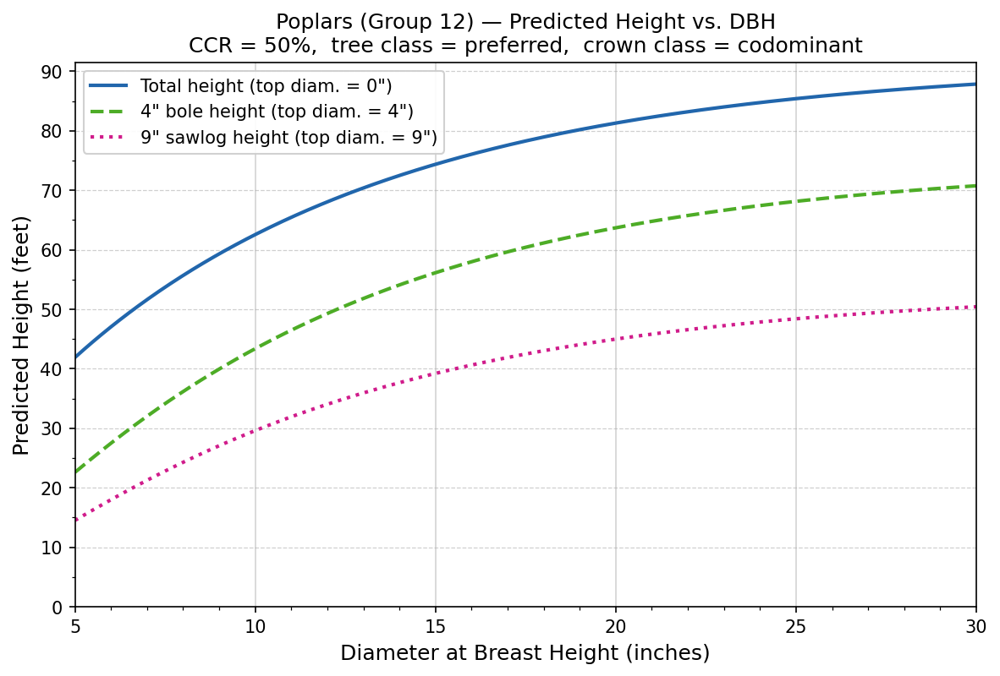

<div align="center">

# Westfall & Laustsen (2006): Height-to-Diameter Model for Maine Tree Species



<sub>Predicted height vs. diameter at breast height (DBH) for a hypothetical poplar using the allometric model  from Westfall and Laustsen (2006).</sub>

</div>

## Overview

This package provides `predict_height_westfall`, a function that predicts tree height (ft) at a given top diameter using the Chapman-Richards allometric model from Westfall and Laustsen (2006). 

It supports 18 species groups in Maine and accepts diameter at breast height (DBH, inches), compacted crown ratio (percent), tree class, crown class, and an optional top diameter (inches). 

Setting `top_diam_in=0` (the default) returns total tree height; providing a non-zero top diameter returns the height to that stem diameter, enabling estimation of merchantable bole height. All six parameters accept either a scalar or an array-like, so mixed-species, mixed-class stands can be predicted in a single call. When any parameter is array-like the inputs are broadcast together and a NumPy array is returned; otherwise a single float is returned.

### `predict_height_westfall`

```python
predict_height_westfall(
    species_group: int | array_like | None,
    dbh_in: float | array_like,
    ccr_pct: float | array_like,
    tree_class: str | array_like,
    crown_class: str | array_like,
    top_diam_in: float | array_like = 0.0,
    *,
    fia_spcd: int | array_like | None = None,
) -> float | numpy.ndarray
```

Predicts tree height (ft) at a specified top diameter using the Chapman-Richards allometric model.

| Parameter | Type | Description |
|-----------|------|-------------|
| `species_group` | `int` or array | Species group number (1–18). Mutually exclusive with `fia_spcd`; exactly one must be provided. |
| `dbh_in` | `float` or array | Diameter at breast height (inches, > 0). |
| `ccr_pct` | `float` or array | Compacted crown ratio (percent, 0–100). |
| `tree_class` | `str` or array | One of `"preferred"`, `"acceptable"`, `"rough"`, `"rotten"`, or `"dead"`. |
| `crown_class` | `str` or array | One of `"dominant"`, `"codominant"`, `"intermediate"`, `"overtopped"`, `"open grown"`, or `"dead"`. |
| `top_diam_in` | `float` or array | Top stem diameter (inches, >= 0) at which to predict height. Defaults to `0.0` for total tree height. |
| `fia_spcd` | `int` or array | FIA species code(s) (keyword-only). Converted to species group numbers before prediction. Mutually exclusive with `species_group`; exactly one must be provided. |

**Returns:** Predicted height in feet as a `float` (scalar inputs) or `numpy.ndarray` (array inputs).

## Model description

Here, we show Equation (2) from Westfall and Laustsen (2006) modified to remove the error term and the random-effects parameters. The model is based on the Chapman-Richards growth equation (Richards 1959).

$$
\begin{aligned}
H_{i} = & \left(\beta_0 D_{i} + \beta_1 CC_{1i} + \beta_2 CC_{2i} + \beta_3 CC_{3i}\right) \\
         & \cdot \left(1 - \exp\left(-\beta_4 DBH_i\right)\right)^{\beta_5 CR_i + \beta_6 TC_i + \left(\frac{D_{i}}{DBH_i} + 0.01\right)^{\beta_7}}
\end{aligned}
$$

where:

$H_{i}$ = tree height (ft) of the $i^{th}$ tree at top diameter $D$.

$D_{i}$ = top-diameter (in.) within the $i^{th}$ tree.

$DBH_i$ = diameter at breast height (in.) of the $i^{th}$ tree.

$CC_{1i}$, $CC_{2i}$, $CC_{3i}$ = The crown class indicators of tree *i*. These are a set of one-hot encoded variables. 

$$
CC_{ki} = \begin{cases}
  k = 1, \; = 1 & \text{intermediate, dead; 0 otherwise} \\
  k = 2, \; = 1 & \text{dominant, codominant, open grown; 0 otherwise} \\
  k = 3, \; = 1 & \text{overtopped; 0 otherwise}
\end{cases}
$$

$TC_i$ = The tree class of tree *i*. TC is an integer coded value between 1 and 3.

$$
TC_i = \begin{cases}
  1 & \text{preferred} \\
  2 & \text{acceptable} \\
  3 & \text{rough/rotten cull, dead}
\end{cases}
$$

$CR_i$ = compacted crown ratio (%; integers 0 - 100) of the $i^{th}$ tree. The units are 

$\beta_0 \text{--} \beta_6$ = fixed-effects population parameters

## Demonstration calculations

Westfall and Laustsen (2006) provided the following example of how to apply the equations using a poplar tree (**species group** = 12) with the following attributes:
- **dbh** = 15.5 in.
- **Compacted crown ratio** = 40 percent
- **Tree class** = acceptable (TC = 2)
- **Crown class** = codominant (CC₁ = 0; CC₂ = 1; CC₃ = 0)

We demonstate that this implementation reproduces the same results. 

## Species Groups

The `species_group` parameter accepts integers 1–18. The table below lists the species group number, the group name, the species name, and the FIA species codes (SPCD) that correspond to each species.

| Group | Species Group Name | Species Names | FIA SPCD |
| :---: | :--- | :--- | :--- |
| 1 | Miscellaneous softwood | Larch (introduced), Norway spruce, Jack pine, Red pine, Pitch pine, Pond pine, Scotch pine | 6212, 91, 105, 125, 126, 128, 130 |
| 2 | Tamarack (native) | Tamarack (native) | 71 |
| 3 | Eastern white pine | Eastern white pine | 129 |
| 4 | White spruce | White spruce | 94 |
| 5 | Black spruce | Black spruce | 95 |
| 6 | Red spruce | Red spruce | 97 |
| 7 | Balsam fir | Balsam fir | 12 |
| 8 | Eastern hemlock | Eastern hemlock | 261 |
| 9 | Northern white-cedar | Northern white-cedar | 241 |
| 10 | Sugar maple | Sugar maple | 318 |
| 11 | Ash | White ash, Black ash, Green ash | 541, 543, 544 |
| 12 | Poplars | Balsam poplar, Eastern cottonwood, Bigtooth aspen, Swamp cottonwood, Quaking aspen | 741, 742, 743, 744, 746 |
| 13 | Miscellaneous hardwood | Shagbark hickory, Black cherry, Scarlet oak, Northern red oak, Black oak, American basswood | 407, 762, 806, 833, 837, 951 |
| 14 | Yellow birch | Yellow birch | 371 |
| 15 | Paper birch | Paper birch | 375 |
| 16 | Other hardwood | Maple, Striped maple, Silver maple, Mountain maple, Norway maple, Ohio buckeye, Serviceberry, Sweet birch, Gray birch, American hornbeam, Butternut, Osage-orange, Apple, Eastern hophornbeam, Pin cherry, Chokecherry, White oak, Swamp white oak, Willow, Black willow, White willow, American mountain-ash, Elm, American elm | 310, 315, 317, 319, 320, 331, 356, 372, 379, 391, 601, 641, 660, 701, 761, 763, 802, 804, 920, 922, 927, 935, 970, 972 |
| 17 | Red maple | Red maple | 316 |
| 18 | American beech | American beech | 531 |

### 1) Prediction of total height

Here, we compute total height. When computing total height, you set the top-height diameter to 0.

$$\begin{aligned}
H_{i0} &= \left(-4.2401(0) + 84.2529(0) + 91.5048(1) + 78.7788(0)\right) \\
&\quad \cdot \left(1 - \exp(-0.1023 \cdot 15.5)\right) \\
&\quad \cdot \exp\left(0.0054(40) + 0.0638(2) + \left(\tfrac{0}{15.5} + 0.01\right)^{0.1422}\right) \\
H_{i0} &= (91.5048) \cdot (0.7943) \cdot \exp\left(0.3436 + (0.01)^{0.1422}\right) \\
H_{i0} &= 75.0 \text{ ft}
\end{aligned}$$

```python
from westfall_2006 import predict_height_westfall

total_height = predict_height_westfall(
    species_group = 12,
    dbh_in = 15.5,
    ccr_pct = 40,
    tree_class = "acceptable",
    crown_class = "codominant",
    top_diam_in = 0.0,
)
# total_height => 75.0 ft
```

### 2) Prediction of bole height (4-in. top diameter)

Conpute the top height of the 4-in. diameter bole.

$$\begin{aligned}
H_{i4} &= \left(-4.2401(4) + 84.2529(0) + 91.5048(1) + 78.7788(0)\right) \\
&\quad \cdot \left(1 - \exp(-0.1023 \cdot 15.5)\right) \\
&\quad \cdot \exp\left(0.0054(40) + 0.0638(2) + \left(\tfrac{4}{15.5} + 0.01\right)^{0.1422}\right) \\
H_{i4} &= (74.5444) \cdot (0.7943) \cdot \exp\left(0.3436 + (0.2681)^{0.1422}\right) \\
H_{i4} &= 56.9 \text{ ft}
\end{aligned}$$

```python
bole_height = predict_height_westfall(
    species_group = 12,
    dbh_in = 15.5,
    ccr_pct = 40,
    tree_class = "acceptable",
    crown_class = "codominant",
    top_diam_in = 4.0,
)
# bole_height => 56.9 ft
```

### 3) Prediction of sawlog height (9-in. top diameter)

Conpute the top height of the 9-in. diameter bole.

$$\begin{aligned}
H_{i9} &= \left(-4.2401(9) + 84.2529(0) + 91.5048(1) + 78.7788(0)\right) \\
&\quad \cdot \left(1 - \exp(-0.1023 \cdot 15.5)\right) \\
&\quad \cdot \exp\left(0.0054(40) + 0.0638(2) + \left(\tfrac{9}{15.5} + 0.01\right)^{0.1422}\right) \\
H_{i9} &= (53.3439) \cdot (0.7943) \cdot \exp\left(0.3436 + (0.5906)^{0.1422}\right) \\
H_{i9} &= 39.8 \text{ ft}
\end{aligned}$$

```python
sawlog_height = predict_height_westfall(
    species_group = 12,
    dbh_in = 15.5,
    ccr_pct = 40,
    tree_class = "acceptable",
    crown_class = "codominant",
    top_diam_in = 9.0,
)
# sawlog_height => 39.8 ft
```

## Citation

If you use this library, please cite [Westfall and Laustsen (2006)](https://academic.oup.com/njaf/article-abstract/23/4/241/4779984).

```{bibtex}
@article{westfall2006merchantable,
  title={A merchantable and total height model for tree species in Maine},
  author={Westfall, James A and Laustsen, Kenneth M},
  journal={Northern Journal of Applied Forestry},
  volume={23},
  number={4},
  pages={241--249},
  year={2006},
  publisher={Oxford University Press}
}
```


